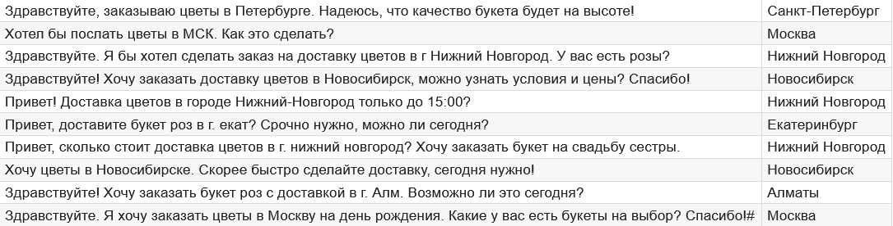

# Программа предсказания городов по сообщению пользователя

✔ Python

✔ Pipenv

✔ Mistral

## Описание задачи
В файле `data.csv` находится 120 сообщений клиентов из чат-бота по заказу доставки цветов. Необходимо определить в каком городе клиент хочет сделать доставку. Результат записывается в файл `result.csv` с новым столбцом `city` - название города, в котором клиент хочет сделать доставку.

Файл `answers.csv` содержит подготовленные правильные ответы для сравнения с `result.csv`.

Полное описание работы программы с комментариями находится в файле `description.md`.

## Запуск программы
Перед использованием необходимо убедиться, что установлен `pipenv`. Если он отсутствует, то требуется установить, используя следующую команду:
```
pip install pipenv
```

Установка проекта:
```
pipenv install
```

Запуск программы:
```
pipenv run python run_prediction.py
```

## Фрагмент полученных результатов
