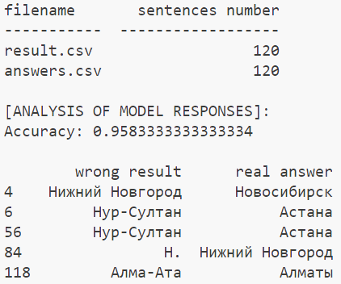

# Полное описание работы программы

## Используемые файлы

- `config.yml`: содержит необходимые параметры для работы программы
	- `llm`: используемая модель
    - `huggingface-hub-token`: токен для доступа к модели
    - `prompt_template`: путь до шаблона инструкции для модели
    - `log_prompts`: если true, то выводит в консоль инструкцию для каждого сообщения
    - `log_llm_responses`: если true, то выводит ответ модели для каждого сообщения
    - `show_sentence`: если true, то выводит анализируемое сообщение клиента
    - `show_responses_analisys`: если true, то выводит анализ ответов модели
    - `show_differences`: если true, то выводится таблица с неправильными ответами модели и ожидаемыми ответами
- `data.csv`: входной файл, содержащий сообщения клиентов по заказу доставки цветов
- `result.csv`: выходной файл, в который записывается результат (с новым столбцом `city` - название города, в котором клиент хочет сделать доставку)
- `answers.csv`: файл, содержащий правильные ответы для сравнения моделей
- `prompts/`: папка, содержащая инструкции для модели
- `images/`: папка, содержащая картинки для readme и descriptions
- `description.md`: файл, содержащий подробное описание действий


## Описание работы программы
В файле `run_prediction.py` на вход подается путь к файлу с сообщениями для анализа (`data.csv`).
Далее происходит вызов функции предиктора для предсказания городов по сообщениям.

На первом этапе анализа загружаются данные из `config.yml` и `data.csv`.

Далее в функции `predict_cities` происходит создание выходного файла с необходимыми заголовками. Во избежание ситуаций с потерей данных при прерывании работы программы сделано следующее. Если файл уже существует, то анализ списка происходит не с первого сообщения, а с сообщения, равному длине существующего файла.

После этого загружаются модель и шаблон для инструкции. На следующем этапе для каждого сообщения в функции `get_city` формируется конкретная инструкция и генерируется ответ модели (обновления фиксируются в progressbar после получения ответа модели). Далее в файл добавляется новая строка.

В конце полученные результаты проверяются в функции `analize` на ответах из `answers.csv`. По умолчанию вывод в консоль следующий:
1. количество строк в сравниваемых файлах (для того, чтобы можно было убедиться, что они совпадают), 
2. точность ответов модели, которая высчитывается по следующей формуле:
    ```
    (количество правильных ответов) / (количество всех ответов)
    ```
3. если точность не равна 1.0, то выводятся ситуации, в которых модель предсказала неверно (номер строки, ответ модели, правильный ответ)

Для повторного тестирования результатов необходимо удалять или переименовать файл `result.csv`.

## Комментарии по заданию

### Изменение названия выходного файла
В тестовом задании в качестве выходного файла был указан `data.csv`, являющийся также и входным. Было принято решение изменить название выходного файла для того, чтобы была возможность тестировать несколько моделей. В таком случае входной файл является неизменным, а выходной файл при необходимости можно удалять или переименовывать.

### Пополнение файла по строкам, а не целиком
Поскольку huggingface ограничивает использование моделей токенами, а также количеством запросов, может возникать ошибка в середине работы программы. Для сохранения уже полученного результата было принято решение пополнять файл построчно, что нивелирует вышеуказанную проблему.

В качестве еще одного варианта решения проблемы можно рассмотреть возможность создавать точку остановки программы и возобновлять ее работу с новым запуском. 

### Анализ ответов модели
Для анализа использовалось сравнение с подготовленными правильными результатами `answers.csv`. Изначально это были ответы модели `mistralai/Mixtral-8x7B-Instruct-v0.1`, которые были перепроверены.

### Спорные моменты названия городов
#### Нур-Султан vs Астана
В 2019-2022 годы город Астана назывался Нур-Султан. Поскольку не до конца понятно существует ли необходимость в выводе `Астана` в предложениях, где указан `Нур-Султан`, было решено оставить этот момент нетронутым.
В качестве идей можно рассмотреть следующее.  Во-первых, можно в основной инструкции просить модель выводить современные названия городов. Во-вторых, можно составить дополнительную проверку названия на актуальность, используя либо дополнительную инструкцию, либо подключить некоторую базу данных (например, WikiData).

#### Алматы vs Алма-Ата
Город в Казахстане по официальным документам называется Алматы, однако в русскоязычных текстах иногда по-прежнему используется название Алма-Ата.
В результатах небольшой модели (описана ниже) можно заметить использование как раз второго варианта.

### Результаты моделей

#### Большая модель mistral (mistralai/Mixtral-8x7B-Instruct-v0.1)
С инструкцией `prompts/prompt.txt` показывает точные результаты.


#### Небольшая модель mistral (mistralai/Mistral-7B-Instruct-v0.2)
С инструкцией `prompts/prompt.txt` показывает более плохие результаты.


Наилучшие результаты для данной модели были достигнуты с использованием инструкции `prompts/prompt_2.txt`



Ошибки модель допускает в ситуациях, когда назвает города их неактуальными именами, например, `Нур-султан` вместо `Астана`. Однако допускает ошибки и в названиях городов:`Нижний Новгород` вместо `Новосибирск`.

Для улучшения результатов необходима доработка инструкции для модели.